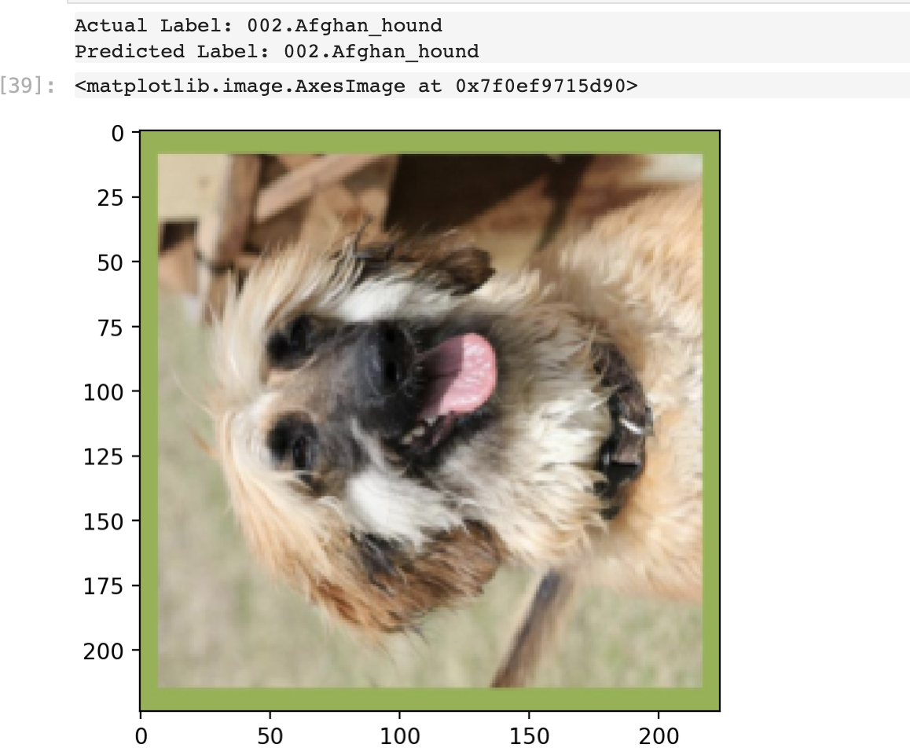
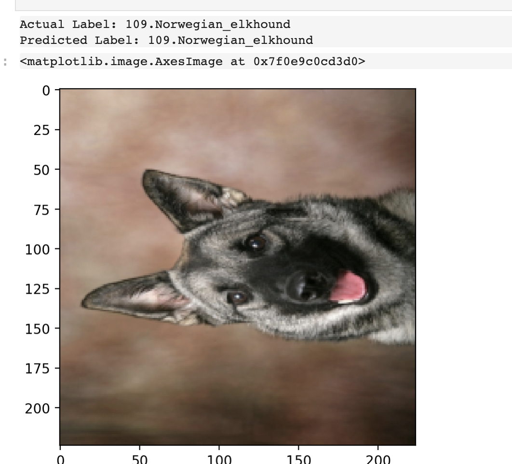
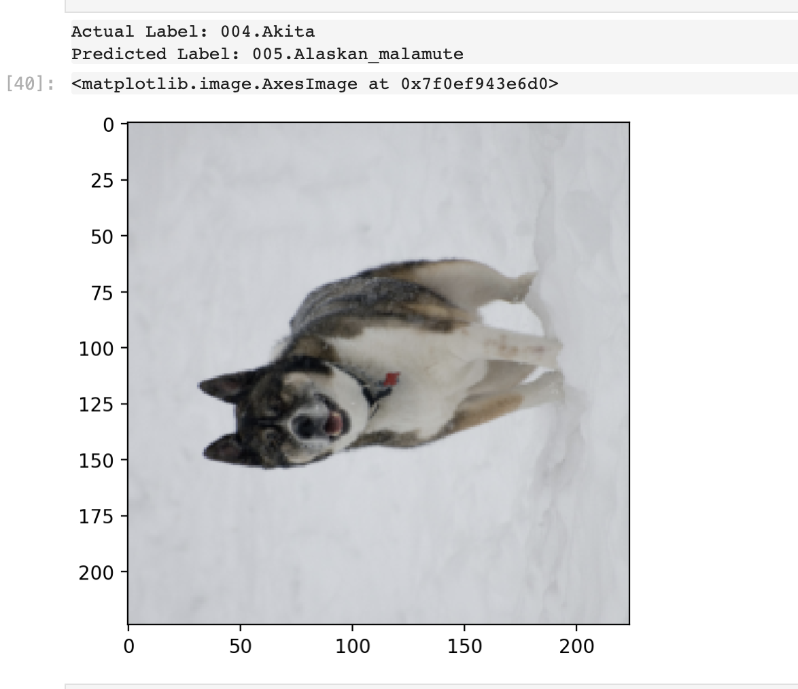
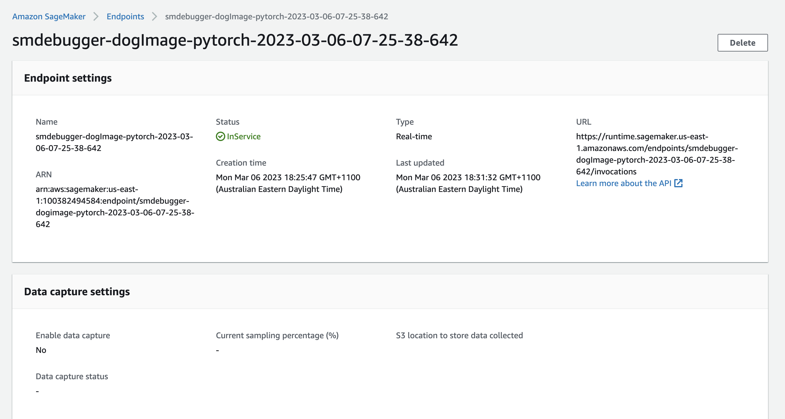

# Image Classification using AWS SageMaker

Use AWS Sagemaker to train a pretrained model that can perform image classification by using the Sagemaker profiling, debugger, hyperparameter tuning and other good ML engineering practices. This can be done on either the provided dog breed classication data set or one of your choice.

## Project Set Up and Installation
Enter AWS through the gateway in the course and open SageMaker Studio. 
Download the starter files.
Download/Make the dataset available. 

## Dataset
The provided dataset is the dogbreed classification dataset which can be found in the classroom.
The project is designed to be dataset independent so if there is a dataset that is more interesting or relevant to your work, you are welcome to use it to complete the project.

### Access
Upload the data to an S3 bucket through the AWS Gateway so that SageMaker has access to the data. 

## Hyperparameter Tuning

I have finetuned a Resnet50 model. I chose this because it has dence layers and should be good to capture the details in the doc breeds.
U have tuned the following hyperparamers for SGD optimizer:
```
hyperparameter_ranges = {
    "lr": ContinuousParameter(0.001, 0.1),
    "momentum": ContinuousParameter(0.0, 1.0),
    "batch-size": CategoricalParameter([32, 64, 128, 256]),
}
```


### completed training jobs


### Hyperparameter Tuning


### Best Hyperparameters


## Debugging and Profiling

<a href="./profiler-report.html" target="_top">profiler-report</a>

### Results
Testing accuract 81%
Some sample results:





## Model Deployment


## Standout Suggestions
**TODO (Optional):** This is where you can provide information about any standout suggestions that you have attempted.
